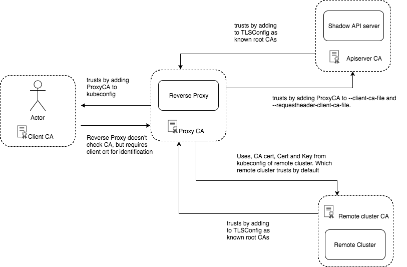

## Main Components

### Proxy
Receives all API requests from the clients. Directs those calls to shadow API server or to remote cluster. Thus providing a uniform view of the composite

Shadow API server can be used to selectively handle Kubernetes API objects. This gives users added control.

### Shadow API Server
Allows users to own and govern certain API objects while still giving a uniform view of the objects resident in remote cluster.

### Certificate management


## Usage

### Vagrant
Vagrant file brings up Centos VM with all the required packages. 
```
vagrant up
```

### create_certs
Once the VM is up. First step is to create certificates. Which can be created using  
```
./create_certs.sh
```
### config
Place kubeconfig for remote cluster in the root directory. Name is currently fixed to `config`. Proxy uses this config to talk to remote cluster. Currently the certs should be embedded in the config and the user in the config should have admin privileges on the remote cluster.

### Proxy server
Proxy server can be built using 
```
go get
go build server.go
```
To start the server using default location for remote cluster kubeconfig (`./config`)
```
./server
```
To start the server specifying location for remote cluster kubeconfig (`./config`)
```
./server -config=./mypath/to/config
```

Proxy server listens on 8080 over TLS. 

kubectl can be used to talk to the proxy server as follows:

```
kubectl --kubeconfig=/home/vagrant/go/src/single-rbac/example-admin-user-config get pods --all-namespaces

kubectl --kubeconfig=/home/vagrant/go/src/single-rbac/example-limited-access-user-config get pods --all-namespaces

```


